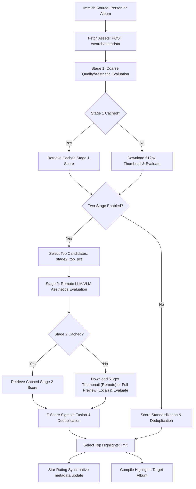

# Immich Aesthetic Scorer

[](https://github.com/jbelew/immich-aesthetic-scorer/actions/workflows/ci.yml)

This tool automates finding the best images of a specific person or album in an **Immich** photo library. It downloads the images, scores them using **Google Gemini**, an **OpenAI-compatible provider** (like OpenAI, Groq, OpenRouter, or local Ollama), or a **local SigLIP/CLIP-based machine learning model**, and adds the top images into a new or existing highlight album.

## Why Did I Build This?

This project was born out of a desire to replicate the ambient slideshow feature of a Google Nest Display. I wanted a way to showcase a curated, high-quality stream of the best photos of my daughter throughout the years on a digital frame.

Doing this manually across a library of over 30,000 images is a monumental task. While Immich does an excellent job of grouping photos by facial recognition, I was still left with over 3,000 images, and Immich doesn't rank them by quality. This tool automates the process by scoring compositions, picking the best facial expressions, filtering out technical defects (like camera shake, motion blur, and noise), and compiling the top-scoring highlights directly into a showcase album ready for display. Additionally, to prevent the highlight album from being cluttered with repetitive shots, a burst deduplication feature groups photos taken within a customizable time window and retains only the single highest-scoring highlight from each burst group.

## System Architecture & Data Flow

The project is structured as a two-stage evaluation pipeline to optimize both cost and quality:



## Recommended Workflow (Cost & Quality Optimization)

For large image sets, scoring every single photo using commercial APIs (like Google Gemini or OpenAI GPT) can become expensive or run into rate limits.

The most cost-effective and high-quality setup is to use a **Hybrid Two-Stage Configuration**:

1. **Stage 1: Coarse Quality Filtering (Local SigLIP)**: Evaluate your entire library locally for free using the fast, local SigLIP-based model (`somepago/AestheticSigLIP`). This runs 100% offline and costs nothing. It acts as a coarse filter to remove obviously bad shots, poor exposure, or accidental captures (filtering out ~85% of your photos).
2. **Stage 2: Aesthetics Evaluation (Remote LLM)**: Send only the top **10% to 15%** of candidate photos (`stage2_top_pct`) to a commercial API (like Gemini `gemini-2.5-flash` or OpenAI `gpt-4o-mini`). The LLM acts as an expert "photography judge" evaluating framing, composition, pose, and facial expressions (like catching closed eyes or awkward mid-speech faces) to curate the final highlight album.

This hybrid setup ensures that:
- **95%** of photos are filtered out for free by the local model.
- Only the top **15%** of candidate photos are sent to commercial APIs for detailed aesthetic and curation evaluation, minimizing your token usage and billing costs.

> [!NOTE]
> **Model Selection & Limitations**:
> - **Default Model (`somepago/AestheticSigLIP`)**: Trained on a broad range of themes (portraits, landscapes, art, etc.) using SigLIP 2, which preserves native aspect ratios (NaFlex) and avoids squashing/stretching.
> - **Alternative Model (`rsinema/aesthetic-scorer`)**: You can configure `"local_model_id": "rsinema/aesthetic-scorer"`. However, note that it is heavily focused on single-person portrait-type photographs and does not perform as well on general scenes or landscapes.
>
> **Tested Local Models & Processing Speeds**:
> 1. `somepago/AestheticSigLIP` (Stage 1 Default): SigLIP 2 (ViT-SO400M) model for overall aesthetic ranking. Preserves aspect ratios natively.
>    * *Performance:* Very fast. Evaluates **512px downscaled thumbnails**; takes **0.2 to 0.5s per image** on CPU (near-instant on GPU).
> 2. `rsinema/aesthetic-scorer` (Stage 1 Alternative): CLIP-based (ViT-L/14) model. Strong on single-person portraiture but biased against landscapes and complex scenes.
>    * *Performance:* Very fast. Evaluates **512px downscaled thumbnails**; takes **0.1 to 0.3s per image** on CPU.
> 3. `musiq-spaq` (Stage 2 Default): MUSIQ-based technical quality assessment model (evaluating sharpness, noise, exposure) from PyIQA.
>    * *Performance:* **Slower on CPU**. Because this model inspects pixel-level technical quality, it downloads and processes **full unscaled preview images** (typically 1440px to 2048px). Expect **5.0 to 15.0s per image** on CPU (runs fast on CUDA-compatible GPUs).
>
> *If you are curating albums containing mostly group shots or complex scenes, you can also select `gemini` or `openai` as your Stage 1 scorer for advanced multimodal capabilities.*

## Features

- **Interactive Setup**: If no arguments are passed, the script prompts you interactively for URL, API keys, selecting a target (Person or Album), and target highlights album name.
- **Interactive Person & Album Search**: You can search for people by name using Immich's facial recognition database or list and search existing albums directly from the CLI.
- **Two-Stage Scoring Pipeline**:
  - **Stage 1 (Coarse Quality Filtering or Aesthetics)**: Evaluates the entire library using a fast, free local quality model (`somepago/AestheticSigLIP` by default) or Gemini/OpenAI APIs.
  - **Stage 2 (Technical Quality or Aesthetics Evaluation)**: Filters the top percentage of candidates from Stage 1. Runs local `musiq-spaq` to filter technical defects (sharpness, noise, motion blur), OR invokes commercial APIs (Gemini/OpenAI) as a "photography judge" to perform deep-dive aesthetics, expression, and composition verification.
  - **Sigmoid Z-Score Fusion**: Standardizes scores from both stages mathematically to a common scale before performing a weighted combination. Non-candidates in two-stage scoring receive a fallback Stage 2 score of 50.0 (representing the population mean) to prevent score deflation and maintain mathematical continuity.
- **Model-Aware Smart Cache**: Scores are saved locally in `.immich_aesthetic_cache.json` alongside their model configuration. If you change models, the script automatically invalidates and re-scores only the affected stages/assets, maintaining full backward compatibility.
- **API Cost Reduction (Client-Side Downscaling)**: For API-based scoring, downscales preview thumbnails to 512px locally. This keeps composition intact while placing requests in the lowest token billing bracket.
- **Burst Deduplication**: Automatically groups burst shots taken within a customizable time window (e.g. 2 minutes) and keeps only the single highest-scoring highlight.
- **Immich Rating Integration**: Synchronizes final scores directly back to Immich's native metadata, mapping scores (0-100) to star ratings (1-5 stars).
- **Threaded Execution**: Parallelizes downloads, evaluation, and rating sync with configurable worker count.

---

## Installation & Setup

1. **Create and Activate a Virtual Environment**:
   ```bash
   python3 -m venv .venv
   source .venv/bin/activate
   ```

2. **Install Core Dependencies**:
   Required libraries for network connections, progress bars, and basic image processing:
   ```bash
   pip install -r requirements.txt
   ```

3. **Install Local Model Dependencies (Optional)**:
   If you wish to run evaluation models locally and offline (such as the default SigLIP aesthetic scorer or the Stage 2 MUSIQ sharpness scorer):
   ```bash
   pip install -r requirements-ml.txt
   ```

4. **Configure Environment Variables (Optional)**:
   Copy the example environment file and fill in your details to avoid typing credentials on every run:
   ```bash
   cp .env.example .env
   # Edit .env and supply your IMMICH_URL and IMMICH_API_KEY
   ```

---

## Configuration & Usage

The script resolves parameters according to the following precedence order:
1. **Command Line Arguments** (e.g. `--immich-url`)
2. **Environment Variables** (e.g. `IMMICH_URL`, see [.env.example](./.env.example) for a template)
3. **Configuration File** (default: `config.json` in the working directory)
4. **Interactive Prompts / Defaults**

### 1. Configuration File (Recommended)
You can store your credentials and parameter tuning in a file like [config.json](./config.json).

#### Example config.json:
See [config.json.example](./config.json.example) for a complete template file.

#### Example Hybrid Two-Stage Configuration (Recommended):
```json
{
  "immich_url": "http://192.168.0.23:2283",
  "immich_api_key": "your-immich-api-key",
  "person_id": "uuid-of-person",
  "target_album_name": "Highlights Album",
  "limit": 100,
  "concurrency": 15,
  "cache_file": ".immich_aesthetic_cache.json",
  "scorer_type": "local",
  "local_model_id": "somepago/AestheticSigLIP",
  "write_ratings": true,
  "dedup_window": 120,
  "two_stage": true,
  "stage2_top_pct": 15.0,
  "stage2_model": "gemini-2.5-flash",
  "stage2_weight": 0.5
}
```

#### Example Single-Stage Local Configuration (100% Free & Offline):
```json
{
  "immich_url": "http://192.168.0.23:2283",
  "immich_api_key": "your-immich-api-key",
  "person_id": "uuid-of-person",
  "target_album_name": "Highlights Album",
  "limit": 100,
  "concurrency": 15,
  "cache_file": ".immich_aesthetic_cache.json",
  "scorer_type": "local",
  "local_model_id": "somepago/AestheticSigLIP",
  "write_ratings": true,
  "dedup_window": 120,
  "two_stage": false
}
```

Run the script using the configuration file:
```bash
./score_assets.py --config config.json
```

### 2. Source Selection Modes

The tool operates on a single source of photos at a time: either a **Person** (using facial recognition) or an **existing Album**. You must select one, or the interactive mode will prompt you:

* **Person Mode** (via `--person-id`): Sources all photos containing a specific person's face. If you run interactively, you can search for a person by name.
* **Album Mode** (via `--album-id`): Sources all photos inside an existing Immich album. This is ideal for curating event albums, trip highlights, or other manually assembled sets.

> [!NOTE]
> These options are mutually exclusive. If both are supplied, the `--album-id` parameter takes precedence and `--person-id` is ignored.

### 3. Interactive Mode
If critical parameters (like Immich Server URL and API Key) are missing from the command-line, environment, and config file, the script will guide you interactively:
```bash
./score_assets.py
```

---

## Command Line Arguments Reference

| Option | Description | Default |
| :--- | :--- | :--- |
| `--immich-url` | Immich server base URL | Prompt / Environment |
| `--api-key` | Immich API Key | Prompt / Environment |
| `--person-id` | Immich Person UUID (Mutually exclusive with `--album-id`) | Interactive search if omitted (choice) |
| `--album-id` | Immich Album UUID to source photos from (Mutually exclusive with `--person-id`) | Interactive search if omitted (choice) |
| `--scorer-type` | Scoring method: `gemini`, `local`, or `openai` | `gemini` |
| `--gemini-key` | Google Gemini developer API key | Prompt / Environment |
| `--gemini-model`| Gemini model ID to use | `gemini-2.5-flash` |
| `--openai-key` | OpenAI API Key (or for compatible providers) | Prompt / Environment |
| `--openai-url` | Base URL for OpenAI-compatible provider | `https://api.openai.com/v1` |
| `--openai-model`| Model ID for OpenAI-compatible provider | `gpt-4o-mini` |
| `--local-model` | Hugging Face model ID for local scoring | `somepago/AestheticSigLIP` |
| `--write-ratings`| Sync star ratings (1-5) to Immich metadata | Off |
| `--target-album-name`| Name of the target highlights album | `Best of <Person Name>` or `Best of Album <Album Name>` |
| `--limit` | Maximum number of top-rated photos to add | `100` |
| `--concurrency`| Maximum parallel threads for downloads/scoring | `5` |
| `--delay` | Pacing delay in seconds between remote requests | `4.0` (Use `0.5` or lower on paid/local) |
| `--dedup-window`| Deduplicate burst photos within N seconds | `0` (Disabled) |
| `--two-stage` | Enable two-stage scoring (Stage 1 Aesthetics, Stage 2 Local Technical Quality or Remote Advanced Aesthetics) | Off |
| `--stage2-top-pct`| Percentage of top candidates to evaluate in Stage 2 | `15.0` |
| `--stage2-model`| Model ID for Stage 2 evaluation (e.g. `musiq-spaq`, `gemini-2.5-flash`, `gpt-4o-mini`) | `musiq-spaq` |
| `--stage2-weight`| Balance weight of Stage 2 score in combined total (0.0 to 1.0) | `0.5` |
| `--use-cache-only`| Compile highlight album from cache, skipping scoring | Off |
| `--cache-file` | Path to the local JSON score cache file | `.immich_aesthetic_cache.json` |
| `--dry-run` | Downloads and scores assets, but skips album operations | Off |
| `--force-score`| Bypasses cache and re-evaluates all images | Off |

---

## Scoring & Rating Metadata System

### Aesthetic Assessment Criteria
1. **Focus/Sharpness**: Heavy penalty for motion blur, camera shake, or missed focus on the subject.
2. **Lighting**: Penalty for flat, severe backlighting, underexposure, or blown-out highlights.
3. **Composition**: Evaluates photographic framing, aspect ratio, clean backgrounds, and margins.
4. **Expression/Pose**: Bonus for smiles, laughter, engaged candids, and open eyes.
5. **Highlight Suitability**: Evaluates if the photo looks like a highlight showcase rather than a random background burst.

### Immich Star Rating Sync Mapping
When `--write-ratings` is enabled, the calculated aesthetic score (0-100) is translated and pushed directly to Immich's native star rating system as follows:
- **Score >= 90**: 5 stars (Outstanding highlight)
- **Score >= 75**: 4 stars (Very Good photo)
- **Score >= 50**: 3 stars (Good/Decent photo)
- **Score >= 20**: 2 stars (Below Average / Poor quality)
- **Score < 20**: 1 star (Very Poor / Bad focus or composition)

---

## Development & Code Quality

See [code_review_and_architecture.md](./code_review_and_architecture.md) for a deep dive into the pipeline design, mathematics, and cache implementation.

This project is set up with pre-commit hooks for static analysis, formatting, and type-checking.

1. **Install Dev Dependencies**:
   ```bash
   pip install pre-commit ruff black pyright
   ```

2. **Initialize Hooks**:
   ```bash
   pre-commit install
   ```

3. **Run Checks Locally**:
   - Format: `black score_assets.py`
   - Lint: `ruff check score_assets.py`
   - Type-check: `pyright score_assets.py`
   - Test: `python -m unittest test_score_assets.py`
