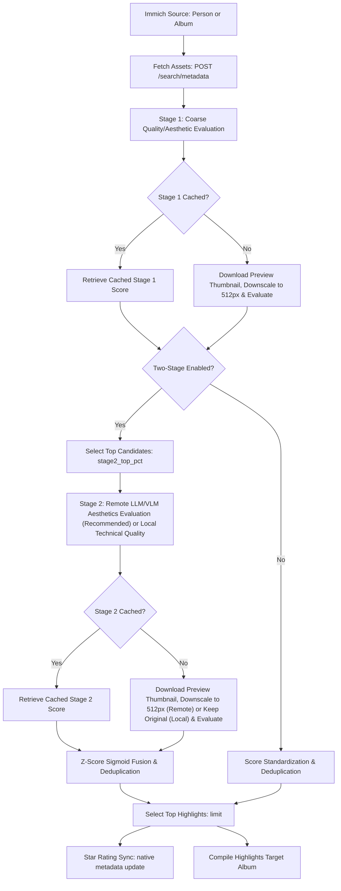

# Architectural and Performance Review

This document provides a detailed overview of the design patterns, mathematical score fusion, concurrency model, and cache validation architecture implemented in the Immich Aesthetic Scorer.

---

## 1. High-Level Architecture & Data Flow

The project is structured as a two-stage evaluation pipeline to optimize both cost and quality:



---

## 2. Key Components & Implementation

### A. Two-Stage Pipelines & Model Compatibility
- **Stage 1 (Composition/Aesthetics)**: Designed to run efficiently over the entire asset library. By downscaling image preview thumbnails locally to `512px` before querying remote APIs, token payload size is reduced by up to 14x.
- **Stage 2 (Local Technical Quality or Remote Advanced Aesthetics)**: Restricts evaluation to a target subset of candidates (configured via `stage2_top_pct` percentage value). Local models (like `musiq-spaq` via `pyiqa`) process unscaled preview thumbnails (`max_dim=None`) to evaluate technical quality (sharpness, noise), whereas remote LLMs (Gemini/OpenAI) evaluate aesthetics/composition on a cost-saving `512px` thumbnail using the advanced aesthetic prompt.

### B. Z-Score Standardization & Sigmoid Normalization
Since Stage 1 and Stage 2 models output raw values on different scales (e.g. 0-10 for local aesthetic model, 0-100 for MUSIQ, 0-100 for Gemini/OpenAI API responses), directly combining raw scores leads to bias. To address this, the pipeline performs **Z-Score Standardization**:

$$z = \frac{x - \mu}{\sigma}$$

Where:
- $x$ is the raw score.
- $\mu$ is the mean of raw scores in the evaluated set.
- $\sigma$ is the standard deviation (calibrated with a **minimum floor of 1.0** for Stage 1 to prevent narrow raw score distributions from over-exaggerating tiny z-score variations).

To combine normalized scores into a 0-100 target range, the Z-scores are mapped using a **logistic sigmoid function**:

$$\text{Score}_{\text{normalized}} = \frac{100.0}{1 + e^{-1.5 \cdot z}}$$

This mathematically translates scores into standard normal distributions, mapping the population mean ($z = 0$) to exactly `50` and ensuring that outlier scores asymptote cleanly towards `0` or `100`.

The final composite score is calculated using the weighted sum:

- **For Stage 2 Candidates**:
  $$\text{Score}_{\text{final}} = (1.0 - w) \cdot \text{Score}_{\text{Stage1}} + w \cdot \text{Score}_{\text{Stage2}}$$
- **For Non-Candidates (Fallback)**:
  To prevent score deflation and ensure mathematical continuity across the candidate boundary, unevaluated non-candidates are assumed to have an average technical quality (the population mean, which maps to $S_2 = 50.0$):
  $$\text{Score}_{\text{final}} = (1.0 - w) \cdot \text{Score}_{\text{Stage1}} + w \cdot 50.0$$

*(Where $w$ is the `stage2_weight`, default: 0.5)*.

### C. Smart Cache Invalidation Schema
The cached data is saved in `.immich_aesthetic_cache.json` under individual asset UUID keys:
```json
{
  "asset-uuid": {
    "raw_score_stage1": 6.55,
    "model_id_stage1": "somepago/AestheticSigLIP",
    "raw_score_stage2": 55.41,
    "model_id_stage2": "musiq-spaq",
    "updatedAt": "2026-07-23T13:30:00.000Z"
  }
}
```
If you change models in `config.json`, the script validates the configuration model IDs against `model_id_stage1` and `model_id_stage2` in the cache. Only mismatched stages are invalidated, preventing expensive re-scoring of cached assets while ensuring consistency.

### D. Concurrency & Performance
- **Parallel Processing**: Uses a `ThreadPoolExecutor` to handle downloads, API/Local scoring, and star rating synchronizations concurrently.
- **PyTorch GIL/Thread Mitigation**: On multi-threaded CPU setups, PyTorch models can lock the GIL or contend for threads. The script mitigates this by restricting CPU threads (`torch.set_num_threads(1)`).
- **Rate Limit Pacing**: Provides a configurable `delay` parameter and a shared global lock (`gemini_call_lock`) to pace remote API requests across both Stage 1 and Stage 2, preventing `429 Too Many Requests` errors.
- **Optimized Cache I/O**: Instead of writing the cache to disk on every single image scoring (which generates high I/O overhead and lock contention), cache writes are batched and executed atomically at the end of the Stage 1 and Stage 2 executors (with `try...finally` protection).

---

## 3. Recommended Developer Enhancements

If you are expanding this project, consider the following additions:
1. **Dynamic Batching**: For local scoring (Stage 1 or Stage 2), batching images before executing inference on GPU would yield 5x-10x throughput speedups.
2. **Additional Local Backbones**: Support for other lightweight vision models (e.g., MobileNetV4, custom fine-tuned ViTs) to run Stage 1 aesthetics evaluation on alternative classification tasks.
3. **Pre-commit Automation**: Run `python -m unittest test_score_assets.py` automatically before each commit to maintain test suite coverage.
