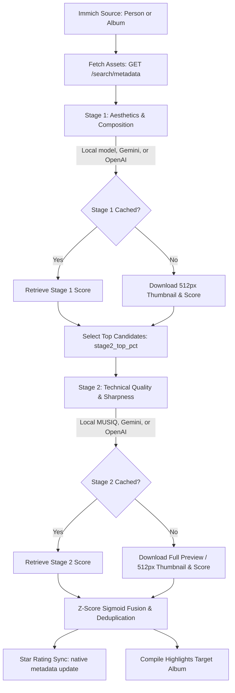

# Code Review & Architecture Analysis

This document provides a comprehensive architectural and code review of the **Immich Aesthetic Scorer & Highlight Album Creator** codebase. It evaluates design patterns, concurrency models, performance bottlenecks, and mathematical score fusion.

---

## 1. System Architecture & Data Flow

The project is structured as a two-stage evaluation pipeline to optimize both cost and quality:



---

## 2. Core Code Review Findings

During our review of [score_assets.py](file:///home/jbelew/projects/immich-scoring/score_assets.py) and [test_score_assets.py](file:///home/jbelew/projects/immich-scoring/test_score_assets.py), we identified several key areas for performance optimization, mathematical improvement, and robust rate limiting.

### 🔴 Finding 1: Extreme Disk I/O Bottleneck in Parallel Workers
* **Component**: Cache Saving Mechanism in `process_s1_asset` and `process_s2_asset`
* **Severity**: High (Performance & Hardware Wear)
* **Description**:
  The cache file `.immich_aesthetic_cache.json` is over 1MB in size. Currently, the worker threads save the *entire* cache to disk after scoring *every single asset*:
  ```python
  def update_cache_entry_threadsafe(key, val):
      with cache_lock:
          cache[key] = val
          save_cache(cache, cache_file)
  ```
  If you are processing 1,000 photos, the script writes a 1MB+ JSON file to disk 1,000 times (1GB+ of total writes) and repeatedly serializes the entire cache in memory. This causes massive thread lock contention, high CPU overhead, and unnecessary write wear on SSDs.

### 🟡 Finding 2: Missing Rate-Limit Pacing in Stage 2 for Remote APIs
* **Component**: Remote API scoring in Stage 2
* **Severity**: Medium (Reliability)
* **Description**:
  In Stage 1, calls to the Gemini/OpenAI API are paced using a global lock (`gemini_call_lock`) and a paced delay:
  ```python
  with gemini_call_lock:
      elapsed = time.time() - last_gemini_call_time
      # Sleep if needed...
  ```
  However, in Stage 2 (`process_s2_asset`), if a remote Gemini/OpenAI model is configured, the calls to `score_image_stage2` are executed concurrently across all `concurrency` worker threads (default: 15) without any lock or pacing delay. This can trigger immediate API rate limits (HTTP 429) or quota exhaustion.

### 🟡 Finding 3: Mathematical Score Deflation for Non-Stage 2 Candidates
* **Component**: Z-score Normalization and Score Fusion
* **Severity**: Medium (Mathematical Integrity & UX)
* **Description**:
  When `two_stage` is enabled, candidates selected for Stage 2 have their scores calculated using a weighted average:
  $$\text{Score}_{\text{final}} = (1.0 - w) \cdot \text{Score}_{\text{Stage1}} + w \cdot \text{Score}_{\text{Stage2}}$$
  However, assets *not* selected for Stage 2 are scored as:
  $$\text{Score}_{\text{final}} = (1.0 - w) \cdot \text{Score}_{\text{Stage1}}$$
  If $w = 0.5$ (default), the scores of all non-candidates (the bottom ~85% of the library) are cut in half. An asset with a decent aesthetic score of 70 will receive a final score of 35 (which maps to 2 stars instead of 3). This artificially deflates the ratings of the majority of your library.

  Furthermore, this creates a boundary discontinuity. An asset just below the cutoff (e.g., $S_1 = 80$) gets a score of 40, while an asset just above the cutoff (e.g., $S_1 = 81$) with a poor Stage 2 score (e.g., $S_2 = 20$) gets $0.5 \cdot 81 + 0.5 \cdot 20 = 50.5$.

### 🟢 Finding 4: In-Thread Model Loading (GIL & Cold Starts)
* **Component**: Local Model Initialization
* **Severity**: Low (Design Cleanliness)
* **Description**:
  Local models are lazily loaded inside the worker threads upon the first task invocation:
  ```python
  with model_lock:
      if local_model is None:
          # Load model...
  ```
  While thread-safe, loading large PyTorch models or vision processors inside parallel threads can lead to unexpected cold-start delays, complex exception handling inside threads, and potential memory peaks.

---

## 3. Actionable Recommendations & Code Diffs

We recommend implementing the following optimizations in [score_assets.py](file:///home/jbelew/projects/immich-scoring/score_assets.py).

### 🛠️ Fix 1: Batch/Periodic Cache Saving
Instead of writing to disk for every asset, we can keep the updates thread-safe in memory and write the cache to disk at the end of the batch, or periodically (e.g., every 10 seconds). We wrap the execution in a `try...finally` block to guarantee cache preservation even if the script is interrupted.

```diff
     failed_count_s1 = 0
+    try:
         with ThreadPoolExecutor(max_workers=concurrency) as executor:
             futures = {executor.submit(process_s1_asset, item): item for item in assets_to_score_s1}
             pbar = tqdm(as_completed(futures), total=len(futures), desc="Stage 1 Scoring")
             for future in pbar:
                 # ... process results ...
+    finally:
+        save_cache(cache, cache_file)
```

In `process_s1_asset` / `process_s2_asset`, we update the in-memory cache dictionary under a thread lock but omit the expensive `save_cache` disk write:

```diff
-        def update_cache_entry_threadsafe(key, val):
-            with cache_lock:
-                cache[key] = val
-                save_cache(cache, cache_file)
+        def update_cache_entry_threadsafe(key, val):
+            with cache_lock:
+                cache[key] = val
```

### 🛠️ Fix 2: Paced Rate Limiting for Stage 2 Remote Calls
Modify the Stage 2 worker thread logic to apply the same rate-limiting paced delay used in Stage 1 when a remote model is chosen:

```diff
             def process_s2_asset(item):
                 asset_id = item["id"]
                 try:
                     is_local_s2 = not (
                         "gemini" in stage2_model.lower()
                         or "openai" in stage2_model.lower()
                         or "gpt" in stage2_model.lower()
                     )
                     max_dim_s2 = None if is_local_s2 else 512
                     img_bytes = download_thumbnail(
                         immich_url, api_key, asset_id, max_dim=max_dim_s2
                     )
 
+                    if not is_local_s2:
+                        with gemini_call_lock:
+                            elapsed = time.time() - last_gemini_call_time
+                            needed_delay = delay if delay > 0 else 4.5
+                            if elapsed < needed_delay:
+                                time.sleep(needed_delay - elapsed)
+                            last_gemini_call_time = time.time()
+
                     # Score using Stage 2 model (like MUSIQ)
                     raw_s2 = score_image_stage2(
                         img_bytes,
                         stage2_model,
                         # ... credentials ...
                     )
```

### 🛠️ Fix 3: Continuous Score Fusion Math
To eliminate the mathematical deflation of non-candidates, we can assume that non-evaluated photos have an average technical quality (the population mean, which maps to exactly $S_2 = 50$ after Z-score standardization):

$$\text{Score}_{\text{final}} = (1.0 - w) \cdot \text{Score}_{\text{Stage1}} + w \cdot 50.0$$

This yields a continuous, smooth score distribution across the boundary and prevents the bottom 85% of photos from being artificially deflated:

```diff
             if "raw_score_stage2" in item:
                 raw_s2 = item["raw_score_stage2"]
                 z2 = (raw_s2 - mean_s2) / std_s2
                 s2_norm = 100.0 / (1.0 + math.exp(-1.5 * z2))
                 s2_norm = min(100.0, max(0.0, s2_norm))
 
                 combined_score = (1.0 - stage2_weight) * s1_norm + stage2_weight * s2_norm
                 final_score = int(round(combined_score))
                 # ...
             else:
-                # Not in top candidates: receive only S1 weight
-                combined_score = (1.0 - stage2_weight) * s1_norm
+                # Assume average technical quality (S2 = 50.0) for non-candidates
+                combined_score = (1.0 - stage2_weight) * s1_norm + stage2_weight * 50.0
                 final_score = int(round(combined_score))
-                reason = f"Stage 1 only: Aesthetics={s1_norm:.1f} (raw: {raw_s1:.2f})"
+                reason = f"Stage 1 only: Aesthetics={s1_norm:.1f} (raw: {raw_s1:.2f}, assumed average S2)"
                 raw_s2 = None
```

---

## 4. Summary of Code Review Recommendations

| Item | Issue | Impact | Recommendation |
| :--- | :--- | :--- | :--- |
| **Cache Writing** | Serialized disk writes on every image | High Disk I/O overhead | Write cache once at the end of the execution block (with `try...finally`). |
| **Stage 2 Pacing** | Parallel API requests bypass pacing | API Quota Exhaustion (429) | Apply the `gemini_call_lock` pacing to Stage 2 remote calls. |
| **Fusion Math** | Non-candidate scores cut in half | Deflated ratings for ~85% of files | Use $S_2 = 50$ (the mean) as the fallback quality score for non-candidates. |
| **Model Loader** | Models loaded inside worker threads | Unclear startup errors | Load local ML models on startup in the main thread. |
